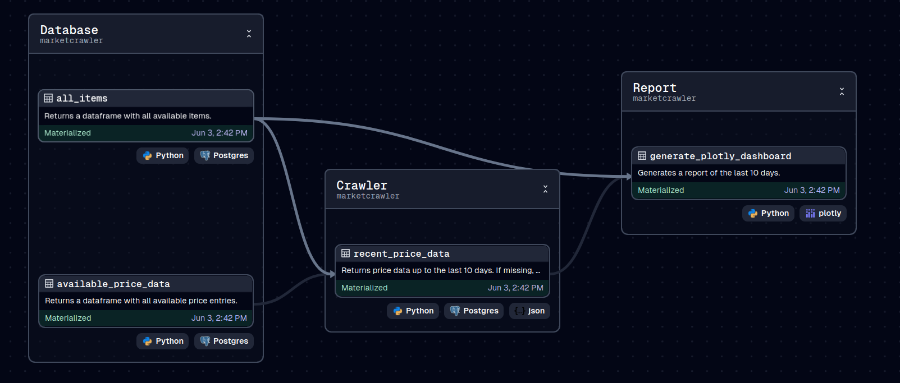

# Dagster-Data-Analysis

An example project for a data analysis pipeline using Dagster. The pipeline crawls prices from a mock price API, stores it in a PostgreSQL database, and generates a plot using Plotly, that will be served from a simple nginx server. The different services are run using docker.



The Data Pipeline in Dagster.
## Quickstart

### Docker Compose Up
To install docker, check out [the Docker docs](https://docs.docker.com/get-started/get-docker/).

If you have docker installed, the next step is to run the docker containers. Make sure to add the `--build` flag, as some containers need to be built. Add `-d` if you wanna hide what the containers are up to.

```bash
docker compose up --build 
```

### Endpoints

After the docker containers are running, the following three services are exposed:

1. Dagster Web UI on http://localhost:3000/
2. A mock price API on http://localhost:8000/
3. A nginx server for viewing the generated plots on http://localhost/dashboards/ (Note: This is empty initially)


### Generating the Report

To see the data pipeline in action, open the Dagster Web UI, click on `Assets` in the headerbar, and click on `View lineage`. Or simply click on http://localhost:3000/asset-groups/. Then you need to click the button that says `Materialize all`. 

This makes dagster run all the steps in order, and generate the report. Under `Runs`, you can find the current run, and if you press `View`, you can access the logs generated during the run. Once its finished, the logs will contain the url to the new plot, or simply move to http://localhost/dashboards/ to see it.